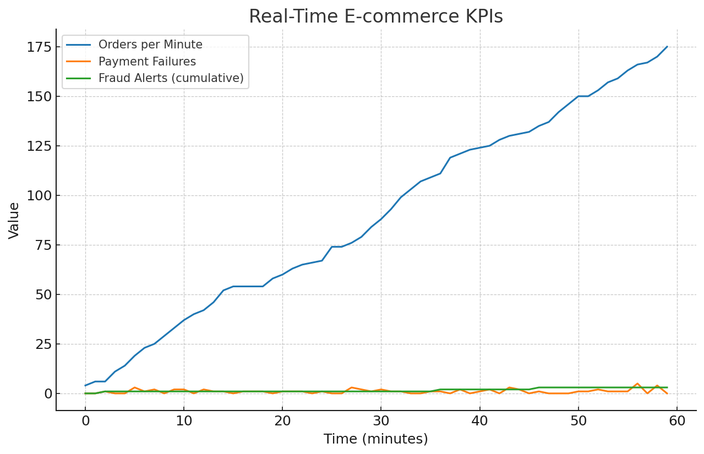

🛒 Real-Time E-commerce Fraud Analytics  

## 📖 Overview  
This project demonstrates an **end-to-end streaming analytics pipeline on AWS** for monitoring e-commerce transactions and detecting fraud in real time. It leverages **Kinesis, Lambda, Spark (EMR), S3, and QuickSight** to simulate, ingest, enrich, and visualize millions of clickstream and payment events.  

---

## 🎯 Objectives  
- ⚡ Ingest high-velocity e-commerce events with **Kinesis Data Streams**  
- 🛠 Process & enrich data with **Spark Structured Streaming on EMR**  
- ✅ Detect anomalies and suspicious transactions with **Lambda fraud rules**  
- 📂 Store raw and enriched data in **S3** for downstream analytics  
- 📊 Build interactive **QuickSight dashboards** for fraud & sales monitoring  
- 🔔 Trigger alerts via **SNS + CloudWatch metrics**  

---

## 🏗 Architecture Workflow  

flowchart LR
    A[🛒 Kinesis Producer<br>(simulated events)] --> B[🌀 Kinesis Stream]
    B --> C[📝 Fraud Detection Lambda<br>(alerts to SNS + CloudWatch)]
    B --> D[🔥 Spark Enrichment Job<br>(on EMR)]
    D --> E[🗄 Amazon S3<br>(raw + enriched layers)]
    E --> F[📊 Redshift Spectrum / QuickSight<br>Dashboards]

##🌟 Features

- Realistic event simulation with Kinesis producers
- Real-time fraud detection Lambda with SNS + CloudWatch integration
- Enrichment & fraud scoring with Spark Streaming on EMR
- Partitioned Parquet outputs in S3 for BI & ML pipelines
- Visual dashboards with QuickSight (example included)

## 🛠 Tech Stack

Streaming: Amazon Kinesis Data Streams & Firehose
Processing: AWS Lambda, Apache Spark (EMR)
Storage: Amazon S3 (raw + enriched zones)
Analytics: Amazon Redshift Spectrum, AWS QuickSight
Monitoring: Amazon CloudWatch, Amazon SNS
Infra: AWS SAM / CloudFormation (template.yaml)

## 📂 Repository Structure
```
.
├── README.md                        # Project overview
├── ingestion_pipeline.py             # Kinesis + Firehose ingestion & simulator
├── fraud_detection_lambda.py         # Real-time fraud detection Lambda
├── enrichment_spark_job.py           # Spark job for event enrichment & fraud scoring
├── template.yaml                     # CloudFormation/SAM template
├── policies/
│   ├── kinesis_producer_policy.json  # IAM policy for producers
│   └── lambda_fraud_policy.json      # IAM policy for fraud Lambda
├── requirements_lambda.txt           # Lambda dependencies
├── requirements.txt                  # Spark/infra dependencies
├── dashboards/
│   └── quicksight_dashboard.png      # Example QuickSight dashboard
├── data/
│   └── sample_events.csv             # Synthetic sample events
 ```

## 📸 Dashboard Preview



## 🔍 Use Cases

🛡 Fraud Detection – real-time alerts for suspicious transactions
📈 Business Analytics – monitor purchases, payments, and user behavior
🔔 Operational Monitoring – track high-value events & failure ratios

##📜 License

This project is for educational and demonstration purposes. Please adapt security, compliance, and scaling before production use.
